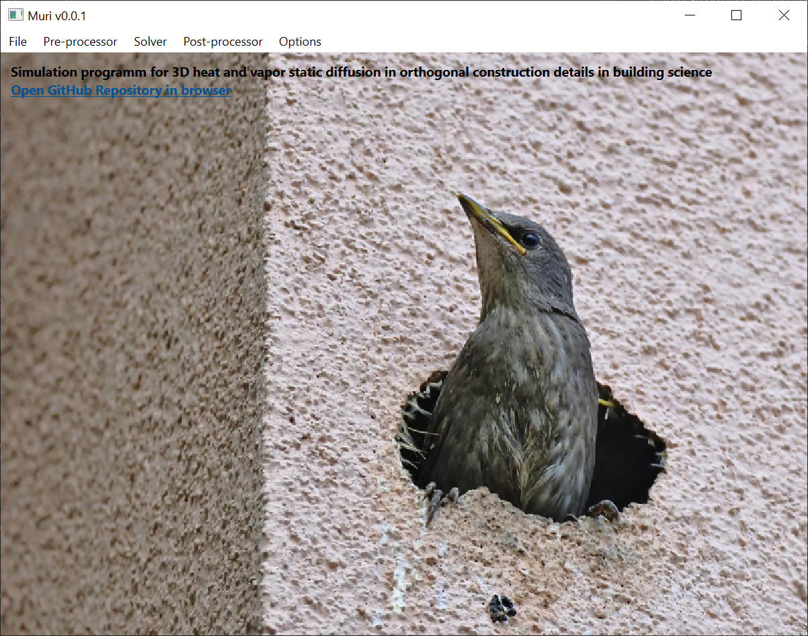

# Muri
Simulation program for 3D heat and vapor static diffusion in orthogonal construction details in building science

### Disclaimer:
This readme file is missing a lot of important informations in order to fully understand the goals and scope of the project, as well as how to build it, run it and contribute to it. Also, I am only an enthusiast programmer and have never been a professional. I have a full-time job and this project and even though I have high ambitions for this project, it remains something that I develop in my spare time. Any help from an experienced programmer is therefore greatly appreciated.

## The program
### Goal
This program is design for architects and engineers to simulate static 3D diffusion of heat and vapor in construction details. The results allow one to check for the safety of the construction detail with regard to condensation and mould growth.

## The development project
### File tree
The project would have 4 main code directories:
- pre-processor
  - receives input from the user and generates an input for the solver
  - allows to save the input to retrieve it later
- solver
  - uses the arguments created by the pre-processor
- post-processor
  - allows to print, display and save the results
- gui
  - graphical interface for the pre-processor, solver and post-processor

### Used libraries and tools
- Compilation commands: [**CMake**](https://cmake.org/)
- Windows: [**Qt**](https://www.qt.io/)
- Graphics: [**OpenGL**](https://www.opengl.org/)
- Code documentation: [**doxygen**](https://doxygen.nl/)
- Linear algebra: [**Eigen**](https://eigen.tuxfamily.org/)
- Unit testing: [**Catch2**](https://github.com/catchorg/Catch2)

## How to compile the project and related files
### Acquiring the files
#### For non-collaborators
Simply fork the repository to your own github. You can then work on this forked version. Once the modifications on the forked repository are all pushed, you can carry out a pull request to the original repository, that the administrators will review.
#### For collaborators
1. You can use the method described above for non-collaborators.
2. You can create a personal branch in which you make your changes. Once the changes have been made, you can make a pull request to merge with the parent branch. Be sure to create one branch per change topic. Avoid using a single branch for changes that are not related to each other. Also, name it so that we understand what it is about. For example, `preprocessor-grid` would specifically deal with the `Grid` class of the `preprocessor`, while `preprocessor-general` would be more general in nature.

### Acquiring the required libraries
Before compiling the project, you must have installed on your computer
1. CMake
2. doxygen
3. Qt Creator

Usually, the installer of Qt Creator has the option to also install OpenGL. If do not install OpenGL this way, make sure that you have installed it separately.

C++ libraries will be acquired at compilation time following the instructions on `CMakeLists.txt`.

### Compiling the project
The project is compiled using CMake and the instructions contained in `CMakeLists.txt`. You can either compile it using Qt Creator GUI or using commands in the terminal.
#### Using Qt Creator GUI
1. To compile the project, open it in Qt Creator.
2. Once opened, go to "Compile" in the top ribbon, then "Compile the project muri". On Windows, the shortcut is Ctrl+B.
3. Once compiled, the project can be executed using "Execute" in the same menu. On Windows, the shortcut is Ctrl+R.

The main window should open and show a similar result to the figure below.



You can change the run executable by
1. Heading to "Projects" in the left-hand side vertical ribbon of Qt Creator.
2. In "Execute", setting "Execution configuration" to another executable, like a unit test file for instance.

#### Using commands in the terminal
_*MISSING PARAGRAPH*_

### Compiling the documentation
_*MISSING PARAGRAPH*_ To compile the documentation, open a terminal at the root of this repository and type
```
empty
```
to compile
```
empty
```


## How to contribute
There are many ways to contribute to this projects:
- Writing code
- Reviewing code and suggesting modifications/improvments
- Creating unit testing and running them
- Writing and refining the documentation
- Providing arts for the software illustrations

Do not hesitate to reach out in case you would like to contribute in a different manner than the ones above.
